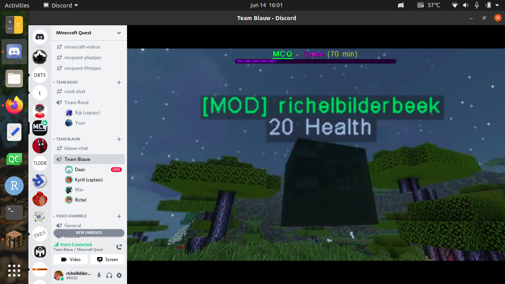
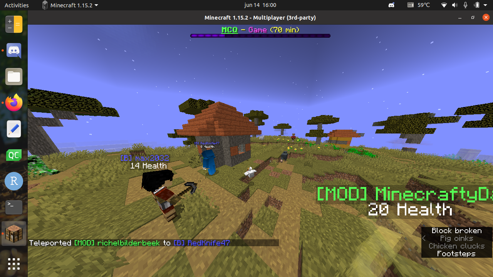
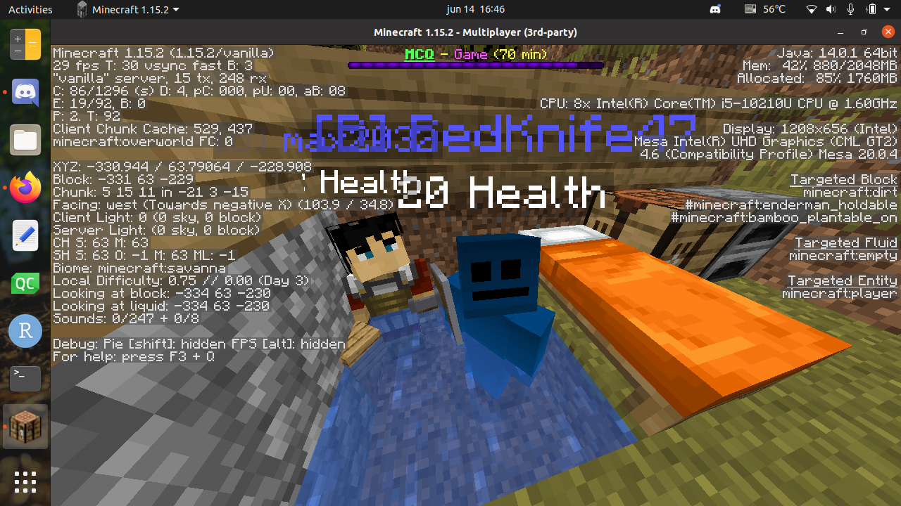
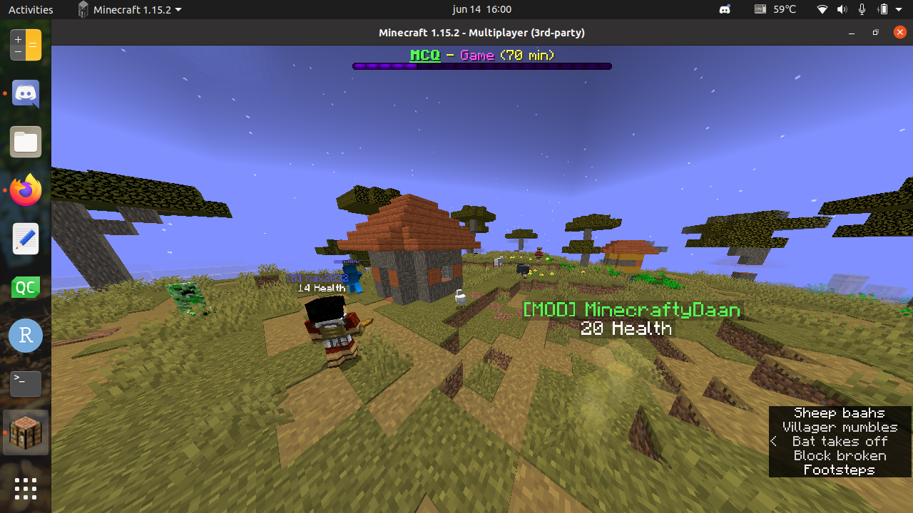
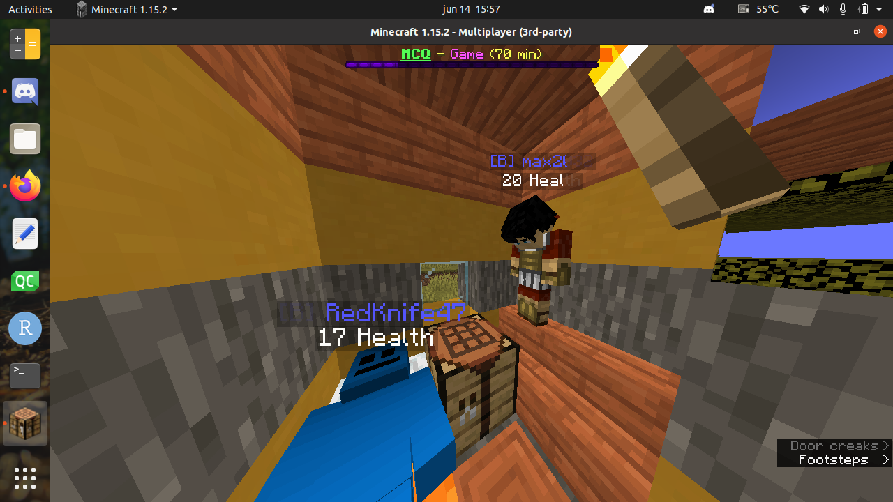
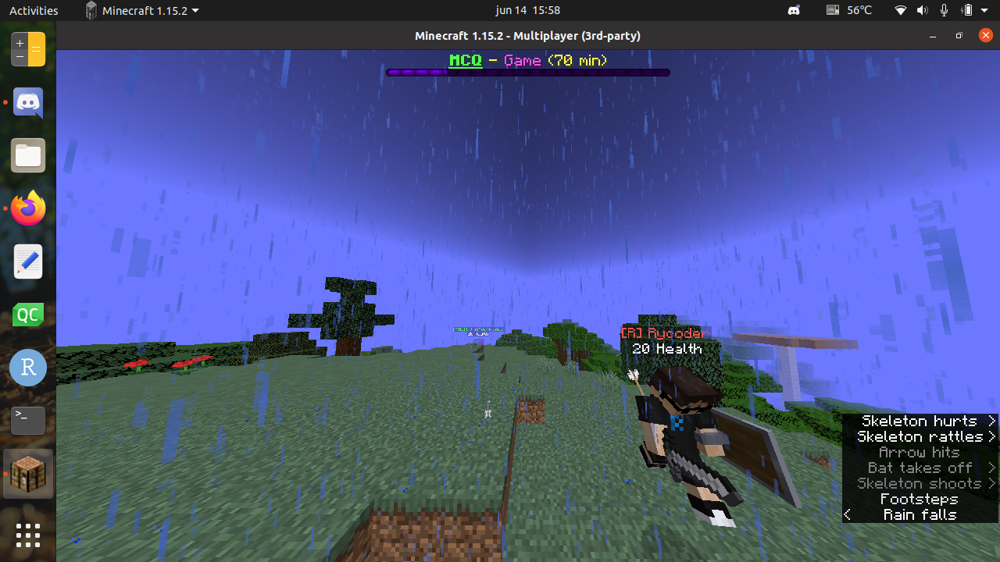
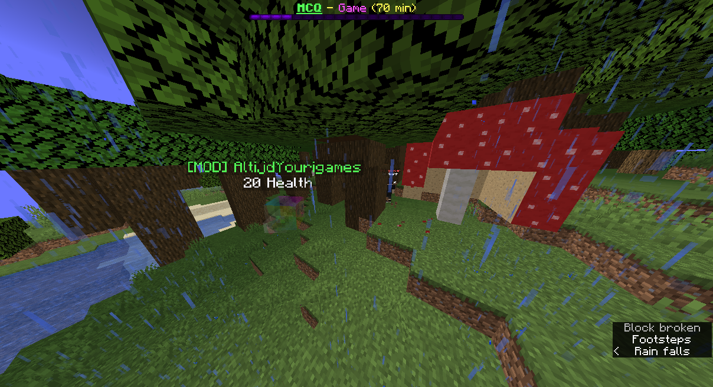
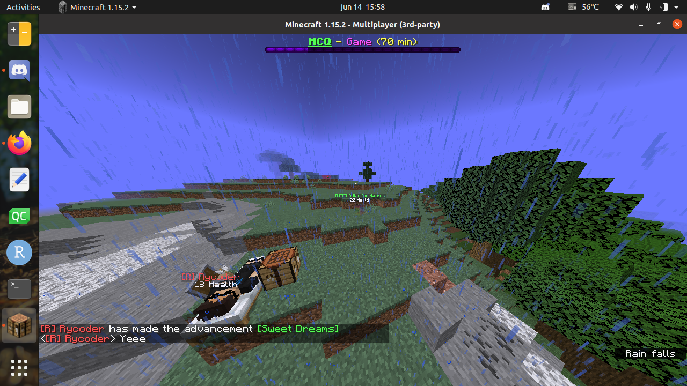

# minecraft_quest

Minecraft wedstrijd.

## Doel

 * Samenwerken

## Server

 * `djog.hosthorde.net`

## Scheidsrechter

 * Richel

## Moderators

 * Daan
 * Youri

## Coaches

:warning: nog niet officieel, maar waarschijnlijk wel :warning:

 * Joshua
 * Rijk

## Hoe

### Try-out

Tot de echte bijeenkomsten zijn, zijn er try-outs op zondagen.

De tryout van zondag 20 juni is van 15:00-17:00.

Tijd       |Taak
-----------|---------------------------
15:00-15:05|Binnenkomst
15:05-15:35|Server open: warming up
15:35-15:40|Server dicht, voor herstart met nieuwe wereld
15:40-16:50|Server open, teams stellen zich op, start wedstrijd
16:50-17:00|Winnaar wordt bepaald en bekend gemaakt

### Bijeenkomst

Bijeenkomsten zijn wekelijks, op donderdag, van 18:00-20:00, op Discord.

Dag        |Quest
-----------|---------------------------
9 juli     |[nog onbekend]
16 juli    |[nog onbekend]
23 juli    |[nog onbekend]
30 juli    |[nog onbekend]
6 augustus |[nog onbekend]
12 augustus|[nog onbekend] (deze is voor 2 punten!)

Dit is het tijdschema:

Tijd       |Taak
-----------|---------------------------
18:00-18:15|Binnenkomst
18:15-18:45|Server open: warming up
18:45-19:00|Server dicht, voor herstart met nieuwe wereld
19:00-20:00|Server open, teams stellen zich op, start wedstrijd
20:00-20:05|Winnaar wordt bekend gemaakt

Elk team heeft een eigen voicechatkanaal op de De Jonge Onderzoekers
Discord server.

### Teams

Er zijn twee teams: het rode en blauwe team. 

De wereld is verdeeld in twee helften:

 * `Rood`: gaat Rechts oftwel oostwaards
 * `blauW`: gaat West oftewel links

### Quest

De Quest is vantevoren bekend: 
deze wordt bepaalt door stemmen op de Discord Minecraft Quest server.
Een voorbeeld: 'verzamel de meeste appels'.
Het team me de meeste punten wint.

### Moderators

Moderators zorgen ervoor dat je op de Minecraft server kunt inloggen.
Dit omdat we een whitelist hebben.

### Scheidsrechters

Scheidsrechters spelen in 'spectator mode'. 
Je kunt ze niet zien.

Een scheidsrechter is altijd ook een moderator.

### Gedrag

 * Gedraag je als een goed teamlid
 * Teams zijn gescheiden
 * We zijn zuinig op de spullen van het team

## Vragen

### Hoe wordt de server ingesteld?

 * Spigot versie 1.15.2
 * Survival mode
 * Easy mobs
 * Geen cheats
 * Geen command blocks

### Waarom zo kort?

Deze tijd is expres kort, zodat je wel goed samen moet werken.

### Hoe worden de quests bepaalt?

Door te stemmen in de Discord Minecraft Quest server.

### Wat is het maximaal aantal spelers?

16.

### Ik heb geen Minecraft

Helaas pindakaas :+1:

### Ik heb geen Minecraft Java Edition

Helaas pindakaas :+1:

### Voor welke leeftijd is dit?

Van 8 t/m 18 jaar.

### Ik wil meedoen, maar ik ben geen deelnemer van De Jonge Onderzoekers

Geen probleem: als er plek is, ben je welkom om mee te doen.

# Hoe maak je Teams aan

Commands voor de Minecraft Quest

[Zie hier](https://github.com/djog/MCQuest_Datapack)

## Video's

 * Eerste try-out: [YouTube](https://youtu.be/xq_MknF9lyY) [Download](http://richelbilderbeek.nl/minecraft_quest_20200531.mp4 )(31 mei 2020, dank aan Rijk van Putten)
 * Tweede testrun: [YouTube](https://youtu.be/8OzPmMhnrKQ) [Download](http://richelbilderbeek.nl/minecraft_quest_20200607.mp4) (7 juni 2020, dank aan Daan Schenkel)

## Screenshots

### 20200614

Screenshots van de try-out van 14 juni 2020.

