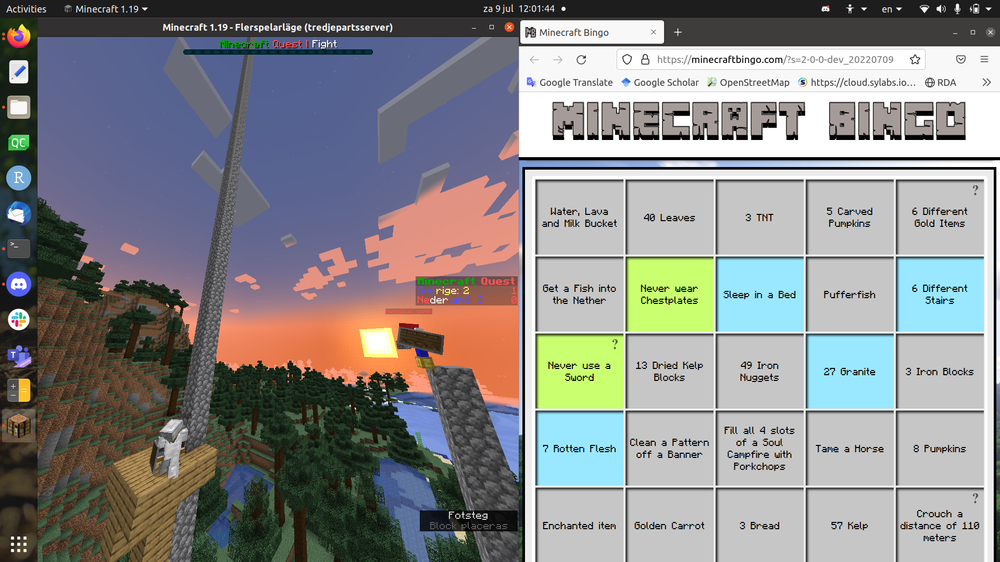

# Minecraft Quest

Minecraft team sports.

## Goal

 * Work together to do as much objectives as possible

## What is Minecraft Quest?

Minecraft Quest is a team sports within the world of Minecraft,
in which a team tries to score as much points as possible.

> Two team members working together

The tasks to get points are known beforehand,
in the form of a bingocard posted on Discord,
with task such as 'Collect 10 apples', 'Kill
5 zombies', etc.

> An example bingo card

Both the world seed and the bingocard seed are known beforehand, so that the
teams can practice.

## Time schedule

From      |To      |What
----------|--------|------------------------
10:00     |11:00   |Server open to moderators
11:00     |11:15   |Server open to players
11:15     |11:50   |Do objectives (i.e. the bingo card)
11:50     |12:00   |Final battle

## Points

 * +1: per bingo card objective
 * +5: per row/column/diagonal on bingo card 
 * +3: win the final battle

## How

### Join

### Schedule

#### Competition

Day      |Quest                                                    |World en bingocard seed  |Server                                                                      |Score (N-S)|Winner
---------|---------------------------------------------------------|-------------------------|----------------------------------------------------------------------------|-----------|-----------
11 june  |[Easy](https://minecraftbingo.com/?s=2-0-0-dev_20220611) |`20220611`               |[home.daanschenkel.nl](home.daanschenkel.nl)                                |8-10       |Sweden
18 june  |[Easy](https://minecraftbingo.com/?s=2-0-0-dev_20220618) |`20220618`               |[minecraftquest.joinjava.net](minecraftquest.joinjava.net)                  |12-2       |Netherlands
25 june  |None, due to Midsommar (an important day in Sweden)      |.                        |.                                                                           |.          |.
02 july  |[Easy](https://minecraftbingo.com/?s=2-0-0-dev_20220702) |`20220702`               |[minecraftquest.joinjava.net](minecraftquest.joinjava.net)                  |14-7       |Netherlands
09 july  |[Easy](https://minecraftbingo.com/?s=2-0-0-dev_20220709) |`20220709`               |[minecraftquest.joinjava.net](minecraftquest.joinjava.net)                  |21-4       |Netherlands
16 july  |[Easy](https://minecraftbingo.com/?s=2-0-0-dev_20220716) |`20220716`               |[minecraftquest.joinjava.net](minecraftquest.joinjava.net)                  |10-3       |Netherlands
23 july  |[Easy](https://minecraftbingo.com/?s=2-0-0-dev_20220723) |`20220723`               |[minecraftquest.joinjava.net](minecraftquest.joinjava.net)                  |15.5-4.5   |Netherlands
30 july  |On Discord                                               |`20220730`               |Bedrock: `images-done.at.playit.gg:24298`, Java: `images-done.at.playit.gg` |22-5       |Netherlands
06 august|On Discord                                               |`20220806`               |Bedrock: `bedrock.mcquest.nl:24298`, Java: `play.mcquest.nl`                |23-6       |Netherlands
13 august|On Discord                                               |`20220813`               |Bedrock: `bedrock.mcquest.nl:24298`, Java: `play.mcquest.nl`                |11-8       |Netherlands

## Players

### Teams

There are 2 teams: Netherlands and Sweden

De world is devided in half:
 * `Netherlands`: goes (N)orth
 * `Sweden`: Goes (S)outh

Participant|Team  |Minecraft username|Role
---------- |------|------------------|-------------------
Rijk       |NL    |.                 |Teamcaptain
Joshua     |NL    |.                 |Reserve teamcaptain
.          |NL    |.                 |.
Egon       |SW    |.                 |.
.          |SW    |.                 |.
.          |SW    |.                 |.
Daan       |-     |`DannyDanDan_`    |Moderator Netherlands
Youri      |-     |`ISYOI`           |Moderator Netherlands/Backup Player
Christiaan |-     |`decommandpro`    |Moderator Sweden
Richel     |-     |`richelbilderbeek`|Referee

## Roles

Minecraft Quest is run by a team of volunteers

> The Minecraft Quest team

### Referee

 * Richel

The purpose of a referee is to ensure the game is played fairly.
A referee is invisible, can freely move around and cannot modify the world.

### Moderators

 * Chris, Daan, Rohan, Youri

The purpose of the moderators is to make the server run smoothly
and that the game can be played fairly and with as little as possible.

A moderator is invisible, can freely move around and cannot modify the world.

### Teamcaptain

 * Jonas/Peter/Rijk/Youri: Team Netherlands
 * None (feel encouraged to take up this role!): Team Sweden

The purpose of the teamcaptains is to steer the team in working together.

A team captain is a regular player.

### Servers

Use ['Minecraft 1.18.2, optifine'](https://optifine.net/adloadx?f=OptiFine_1.12.2_HD_U_G5.jar).

### Behavior

 * Behave as a good team member
 * Teams both have half of the world.
 * We don't steal from our team and be respectful to our team members.
 * The usage of any (hacked) clients are strictly forbidden. 
   The only clients that are allowed are FPS boosters such as optifine. 
   NO waypoints, minimaps and such.

## FAQ

### What are the settings?

 * Minecraft 1.18.2 (stable)
 * Survival mode
 * Easy mode
 * No command blocks

### Why so short?

Its intentionally so you have to work with your team.

### What is the maximum amount of players?

16.

### I don't have Minecraft

Then you cannot participate 

### I don't have Minecraft Java but I do have Bedrock

You can still participate! You can join the mcquest server on any bedrock platform.

### Whats the age limit?

From 8 to (and including) 18 years.

### I did something on the bingo card. What do I do?

The Discord bingo cards detect this automatically.
If not, talk to the referee.
He/she'll take a look at your inventory and/or your surroundings.

### Can I use my [resources] after I scored a point with them?

Yes! If, for example, there was an objective to collect 16 carrots,
you can eat those after a referee has seen you did.

### A team member and I **together** have collected enough [resources]. Does that count?

No, the resources must be in the same inventory.

### I have a question

Join the Discord or make an issue on GitHub.

### How does the server work?

We're using multiple plugins made by [Daan and Youri](https://github.com/daanschenkel), 
you can find those in the repository.

## Video's

Newest video's at at the top.

 * 2022-08-05: Look around: [YouTube](https://www.youtube.com/watch?v=HaId_SyQmCk) [Download](http://richelbilderbeek.nl/minecraft_quest_20200607.mp4) (thanks Daan Schenkel)
 * 2020-07-07: Second testrun: [YouTube](https://youtu.be/8OzPmMhnrKQ) [Download](http://richelbilderbeek.nl/minecraft_quest_20200607.mp4) (thanks Daan Schenkel)
 * 2022-05-31: First try-out: [YouTube](https://youtu.be/xq_MknF9lyY) [Download](http://richelbilderbeek.nl/minecraft_quest_20200531.mp4 )(thanks Rijk van Putten)

### Links

 * [Minecraft Quest YouTube channel](https://www.youtube.com/channel/UCkhQIR-X6Xx11VRZV9co-lA)

## Screenshots

## 20220806

### 2022-07-30

### 2022-07-23

### 2022-07-09

### 2022-06-18

### 2022-06-11

See [2020.md](2020.md) for screenshots of the first MCQ

