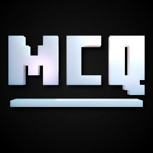
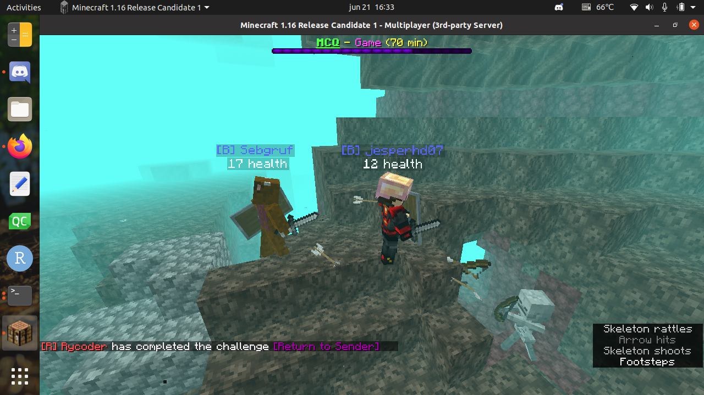
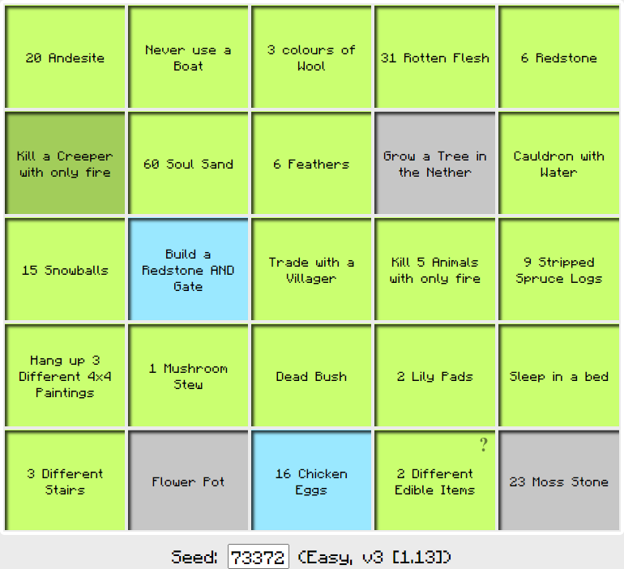
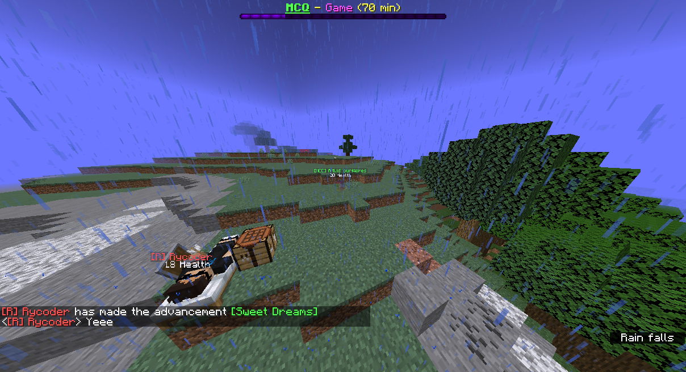

# De Minecraft Quest

Minecraft wedstrijd.

## Doel

 * Samenwerken

## Rollen

### Scheidsrechter

 * Richel

### Moderators

 * Daan: Team Blauw
 * Youri: Team Rood

### Coaches

:warning: nog niet officieel, maar waarschijnlijk wel :warning:

 * Joshua
 * Rijk

## Hoe

### Meedoen

Druk hieronder om de server te joinen:

### Bijeenkomst

Bijeenkomsten zijn wekelijks, op donderdag, van 18:00-20:00, op Discord.

Dag        |Quest                                                                             |World seed |Server
-----------|----------------------------------------------------------------------------------|-----------|-------------------------------------------------------
9 juli     |[Easy](https://minecraftbingo.com/?s=2-0-0-3_20200709)                            |`20200709` |[mcquest.mc-srv.com](mcquest.mc-srv.com) (Rijk's server)
16 juli    |[Easy](https://minecraftbingo.com/?s=2-0-0-3_20200716)                            |`20200716` |[djogmcquest.mc-srv.com](djogmcquest.mc-srv.com) (Daan's server)
23 juli    |[Easy](https://minecraftbingo.com/?s=2-0-0-3_20200723)                            |`20200723` |[djogmcquest.mc-srv.com](djogmcquest.mc-srv.com) (Daan's server)
30 juli    |[Easy](https://minecraftbingo.com/?s=2-0-0-3_20200730)                            |`20200730` |[mcquest.mc-srv.com](mcquest.mc-srv.com) (Rijk's server)
6 augustus |[Easy](https://minecraftbingo.com/?s=2-0-0-3_20200806)                            |`20200806` |[mcquest.mc-srv.com](mcquest.mc-srv.com) (Rijk's server)
13 augustus|[Medium](https://minecraftbingo.com/?s=2-0-0-3_20200812) (deze is voor 2 punten!) |`20200812` |[mcquest.mc-srv.com](mcquest.mc-srv.com) (Rijk's server)

### Teams

Deelnemer|Team  |Opmerkingen
---------|------|-----------
?Joshua  |Blauw |Captain
Mia      |Blauw |
Quinn    |Blauw |
Rashid   |Blauw |
Jesse    |Blauw |
Rymer    |Blauw |
?Jesper  |Blauw |
.        |Blauw |
.        |Blauw |
Rijk     |Rood  |Captain, behalve 16 en 23 juli
Rafayel  |Rood  |?Captain, op 16 en 23 juli
Yassir   |Rood  |
Neelie   |Rood  |
Erryn    |Rood  |
?Seb     |Rood  |
.        |Rood  |
.        |Rood  |
.        |Rood  |
Daan     |-     |Moderator
Youri    |-     |Moderator
Richel   |-     |Scheidsrechter

### Teamcaptains

Dag        |Team Blauw        |Team Rood
-----------|------------------|-----------------
9 juli     |Joshua            |Rijk
16 juli    |Joshua            |?Rafayel
23 juli    |Joshua            |?Rafayel
30 juli    |Joshua            |Rijk
6 augustus |Joshua            |Rijk
13 augustus|Joshua            |Rijk

Dit is het tijdschema:

Tijd       |Taak
-----------|---------------------------
18:00-18:15|Binnenkomst
18:15-18:45|Server open: warming up
18:45-19:00|Server dicht, voor herstart met nieuwe wereld
19:00-20:00|Server open, teams stellen zich op, start wedstrijd
20:00-20:05|Winnaar wordt bekend gemaakt

Elk team heeft een eigen voicechatkanaal op de De Jonge Onderzoekers
Discord server.

### Teams

Er zijn twee teams: het rode en blauwe team. 

De wereld is verdeeld in twee helften:

 * `Rood`: gaat Rechts oftwel oostwaards
 * `blauW`: gaat West oftewel links

### Servers

 * [mcquest.mc-srv.com](mcquest.mc-srv.com): Rijk's server, 
 * [djogmcquest.mc-srv.com](djogmcquest.mc-srv.com): Daan's server

Instellen op 'Minecraft 1.16.1, stable'.

### Quest

De Quest is vantevoren bekend
en is in de vorm van een bingokaart.
De 'seed' van deze bingokaart is vantevoren bekend:
dit is de datum van de dag in JJJJMMDD,
op de moeilijkheid Easy.
Hier is de link voor 2020-07-09 (9 juli):
[https://minecraftbingo.com/?s=2-0-0-3_20200709](https://minecraftbingo.com/?s=2-0-0-3_20200709).
Ook de Minecraft wereld heeft deze seed, zodat een team zich goed kan voorbereiden.

### Moderators

Moderators zorgen ervoor dat je op de Minecraft server kunt inloggen.
Dit omdat we een whitelist hebben.

### Scheidsrechters

Scheidsrechters spelen in 'spectator mode'. 
Je kunt ze niet zien.

Een scheidsrechter is altijd ook een moderator.

### Gedrag

 * Gedraag je als een goed teamlid
 * Teams zijn gescheiden
 * We zijn zuinig op de spullen van het team
 * Het gebruik maken van cheats/mods/hacked clients is niet toegestaan! 
   Alleen optifine is eventueel toegestaan!

## FAQ

### Hoe wordt de server ingesteld?

 * Minecraft 1.16 (in de nieuwste snapshots totdat het uit is)
 * Survival mode
 * Geen cheats
 * Geen command blocks

### Waarom zo kort?

Deze tijd is expres kort, zodat je wel goed samen moet werken.

### Hoe worden de quests bepaalt?

We pakken

### Wat is het maximaal aantal spelers?

16.

### Ik heb geen Minecraft

Helaas pindakaas :+1:

### Ik heb geen Minecraft Java Edition

Helaas pindakaas :+1:

### Voor welke leeftijd is dit?

Van 8 t/m 18 jaar.

### Ik wil meedoen, maar ik ben geen deelnemer van De Jonge Onderzoekers

Geen probleem: als er plek is, ben je welkom om mee te doen.

### Ik heb alsnog een vraag

Prima, email De Jonge Onderzoekers op `info@dejongeonderzoekers.nl`

### Hoe werkt de server?

We maken gebruik van onze zelf gemaakte datapack!

[Zie hier](https://github.com/djog/MCQuest_Datapack)

## Video's

 * Eerste try-out: [YouTube](https://youtu.be/xq_MknF9lyY) [Download](http://richelbilderbeek.nl/minecraft_quest_20200531.mp4 )(31 mei 2020, dank aan Rijk van Putten)
 * Tweede testrun: [YouTube](https://youtu.be/8OzPmMhnrKQ) [Download](http://richelbilderbeek.nl/minecraft_quest_20200607.mp4) (7 juni 2020, dank aan Daan Schenkel)

### Links

 * [Minecraft Quest fansite](http://mcquest.is-great.net)
 * [Minecraft Quest YouTube kanaal](https://youtu.be/MAWhR-EyciM)

## Screenshots

### 20200621

### 20200614

Screenshots van de try-out van 14 juni 2020.

